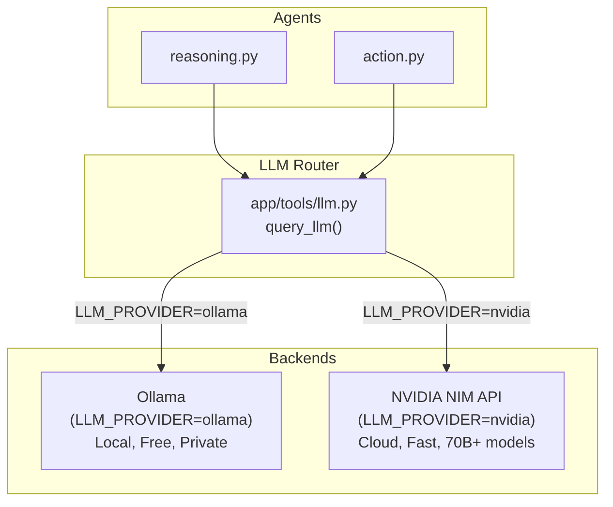
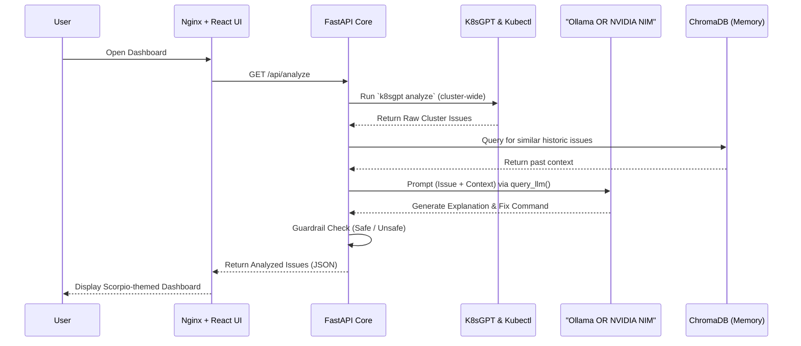
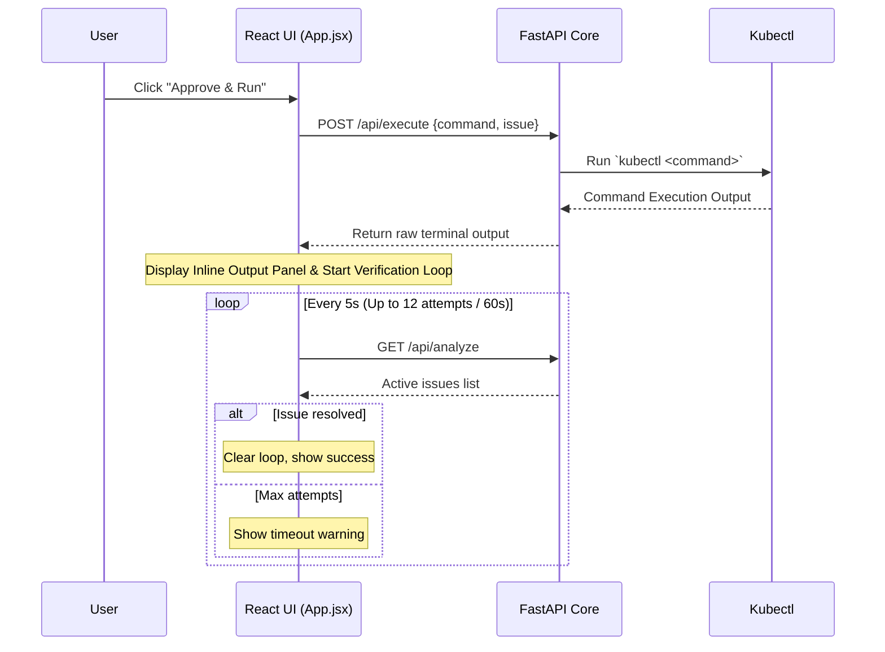

# K8s Agentic AI Architecture & Flow Guide

Welcome to the detailed architectural breakdown of the **KubeOps-AI Dashboard**. This document explains the purpose, components, and data flow of the entire system, combining insights from the Kubernetes deployments, FastAPI backend, and React frontend.

---

## 🎯 What is it used for?

The KubeOps-AI system is a **powerful, autonomous troubleshooting pipeline** designed to monitor, diagnose, and remediate issues within a Kubernetes cluster. 

Instead of an administrator manually hunting down failing pods or reading cryptic logs, this system automatically:
1. Discovers cluster issues using `k8sgpt`.
2. Analyzes the root cause using your **chosen LLM** — either a private, local model (Ollama) or a powerful cloud model (NVIDIA NIM API).
3. Consults an "Incident Memory" (Vector Database) to remember past fixes.
4. Suggests a concrete `kubectl` command to fix the issue.
5. Provides a web-based UI where an admin can safely **Approve & Run** the remediation with one click.

---

## 🤖 LLM Provider Architecture

The system supports two LLM backends, selectable at deploy time via the `LLM_PROVIDER` environment variable. The unified `app/tools/llm.py` module routes all agent calls to the correct backend transparently.



### LLM Provider Comparison

| Feature | Local Ollama | NVIDIA NIM API |
|---|---|---|
| **Cost** | Free | Pay-per-token (free tier available) |
| **Privacy** | 100% on-premise | Cloud API call |
| **Speed** | Slower (CPU) | Very fast (GPU cloud) |
| **Model Quality** | TinyLlama / Gemma 2B | 70B+ parameter models |
| **Internet Required** | No (after image pull) | Yes |
| **Setup** | Auto (setup.sh pulls model) | NVIDIA API key required |
| **k8sgpt backend** | `ollama` | `openai` (compatible API) |

---

## 🔄 End-to-End System Flow

### 1. Manual Analysis & Execution Flow



### 2. Event-Driven Webhook Alert Flow


### 3. Execution & Verification Loop Flow



---

## 🖥️ The Frontend Approach

The frontend is a **React + Vite** application built for speed and aesthetics. 

> [!TIP]
> The UI uses a custom **Scorpio Theme** built entirely with pure, vanilla CSS. It avoids heavy external libraries like Tailwind or Bootstrap to keep the bundle size small while delivering a premium, dark-mode, glassmorphic aesthetic with neon accents.

### Routing & Communication
Because the React app runs in the user's browser, it cannot directly resolve internal Kubernetes DNS. To solve this:
- The frontend is served inside the cluster using an **Nginx** web server.
- Nginx is configured as a **Reverse Proxy**.
- The React app makes requests to `/api`, and Nginx intercepts these and securely forwards them to the internal FastAPI backend service.

### Remediation Verification Loop
After a user approves and executes a fix:
- An animated `Verifying fix… poll N/12` badge appears.
- A background `setInterval` polls the backend every 5 seconds.
- If the issue disappears from the issues list, the loop terminates and the UI updates automatically.
- A manual **Refresh button** and **Last refreshed** timestamp are always available in the header.

---

## 🧠 The Backend Approach

The backend is built with **FastAPI** (Python) and acts as the "Intelligence Core" of the system.

### Directory Structure & Roles
- **Agents (`app/agents/`)**:
  - `analyzer.py`: Orchestrates the pipeline. Scoped `--namespace` support. Backward-compat env var alias.
  - `reasoning.py`: Builds the contextual prompt and calls `query_llm()`.
  - `action.py`: Generates the actionable `kubectl` command via `query_llm()`.
  - `guardrail.py`: Blocks destructive commands. If the AI suggests `delete`, `rm`, or `wipe`, marks `safe: false`.
- **Tools (`app/tools/`)**:
  - `llm.py`: **Unified LLM router**. Reads `LLM_PROVIDER` and dispatches to the correct backend.
  - `ollama.py`: Ollama HTTP client (used when `LLM_PROVIDER=ollama`).
  - `k8sgpt.py`: k8sgpt subprocess runner (supports `--namespace` scoping).
  - `kubectl.py`: kubectl subprocess runner.
  - `vector_store.py`: ChromaDB Incident Memory client.

### Key Environment Variables

| Variable | Values | Purpose |
|---|---|---|
| `LLM_PROVIDER` | `ollama` / `nvidia` | Selects the active LLM backend |
| `NVIDIA_API_KEY` | `nvapi-...` | From K8s Secret — never committed to code |
| `NVIDIA_MODEL` | Any NIM model ID | Default: `nvidia/llama-3.3-nemotron-super-49b-v1` |
| `OLLAMA_MODEL` | Any Ollama tag | Default: `tinyllama:latest` |
| `KUBEOPS_ENABLE_FULL_AI` | `true` / `false` | Enable LLM reasoning pipeline |

> [!IMPORTANT]
> **Incident Memory**: Every time a user successfully runs an action, the backend saves the `(Issue → Successful Command)` pairing into ChromaDB. The next time a similar issue occurs, the reasoning agent fetches this memory and feeds it to the LLM — the system **learns** from past outages regardless of which LLM backend is active.

### Webhook API
- `POST /webhook/alert`: Receives alert payloads. If `status == "firing"`, queues a BackgroundTask to analyze only the affected namespace.
- `GET /webhook/results`: Serves cached analysis results to the dashboard.
- `GET /health`: Liveness/readiness probe.

---

## 🐳 The Kubernetes (K8s) Approach

### Component Breakdown
1. **Namespace (`namespace.yaml`)**: Creates `k8s-ai` sandbox.
2. **Ollama (`ollama.yaml`)**: *(Ollama mode only)* Deploys the local LLM server. Completely skipped in NVIDIA mode.
3. **Backend (`backend.yaml`)**: FastAPI intelligence core.
    - Configures `LLM_PROVIDER`, `NVIDIA_API_KEY` (from Secret), `NVIDIA_MODEL`, `OLLAMA_URL` etc.
    - **postStart hook** runs `k8sgpt auth add` configured for the active provider.
    - `KUBEOPS_ENABLE_VECTOR_STORE: "true"` — ChromaDB Incident Memory enabled by default.
    - NVIDIA API key injected from `nvidia-api-key` Secret via `valueFrom.secretKeyRef` (marked `optional: true` so Ollama mode pods still start).
4. **Frontend (`frontend.yaml`)**: Nginx + React UI via NodePort `30007`.
5. **nvidia-secret.yaml**: Template for the Kubernetes Secret. Populated by `setup.sh` at runtime.

### Connecting it all together
- **Frontend Pod** receives traffic on port `30007`.
- Nginx routes `/api` traffic internally to the **Backend Service** on port `8000`.
- Backend calls **Ollama Service** (internal port `11434`) OR **NVIDIA NIM API** (external HTTPS) based on `LLM_PROVIDER`.
- Backend uses mounted `kubeconfig` to talk to the **Kubernetes API Server**.

---

## 📈 The Observability Stack

All observability components are exposed via NodePorts for direct access:

| Component | NodePort | Role |
|---|---|---|
| **Prometheus** | `32001` | Scrapes metrics, evaluates alert rules |
| **Alertmanager** | `32002` | Routes alerts to Antigravity Listener |
| **Grafana** | `32000` | Visual dashboards (`admin` / `admin`) |
| **Antigravity Listener** | Internal | Webhook bridge: Alertmanager → Backend |

### Event Flow
```
Pod Failure
  → Prometheus (detects via alert rules)
  → Alertmanager (routes via webhook)
  → Antigravity Listener (POST /webhook/alertmanager)
  → FastAPI Backend (POST /webhook/alert)
  → BackgroundTask: k8sgpt --namespace <ns> + query_llm()
  → _webhook_results cache
  → React Dashboard (polls GET /webhook/results)
  → Admin sees issue card → Approve & Run → Fix verified
```
