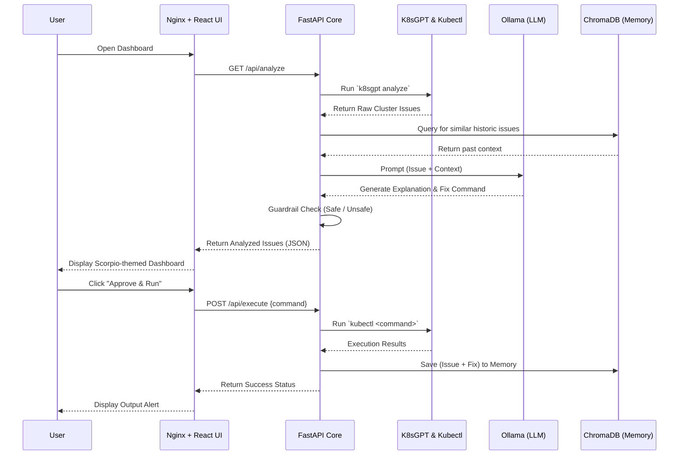

# K8s Agentic AI Architecture & Flow Guide

Welcome to the detailed architectural breakdown of the **K8s Agentic AI Dashboard**. This document explains the purpose, components, and data flow of the entire system, combining insights from the Kubernetes deployments, FastAPI backend, and React frontend.

---

## 🎯 What is it used for?

The K8s Agentic AI system is a **powerful, autonomous troubleshooting pipeline** designed to monitor, diagnose, and remediate issues within a Kubernetes cluster. 

Instead of an administrator manually hunting down failing pods or reading cryptic logs, this system automatically:
1. Discovers cluster issues using `k8sgpt`.
2. Analyzes the root cause using a private, local Large Language Model (Ollama with Gemma 2B).
3. Consults an "Incident Memory" (Vector Database) to remember past fixes.
4. Suggests a concrete `kubectl` command to fix the issue.
5. Provides a beautiful, web-based UI where an admin can safely **Approve & Run** the remediation with one click.

---
## 🔄 End-to-End System Flow

The following Mermaid diagram illustrates how the components interact when a user opens the dashboard and runs a fix.

---

## 🖥️ The Frontend Approach

The frontend is a **React + Vite** application built for speed and aesthetics. 

> [!TIP]
> The UI uses a custom **Scorpio Theme** built entirely with pure, vanilla CSS. It avoids heavy external libraries like Tailwind or Bootstrap to keep the bundle size incredibly small while delivering a premium, dark-mode, glassmorphic aesthetic with neon accents.

### Routing & Communication
Because the React app runs in the user's browser, it cannot directly resolve internal Kubernetes DNS (like `backend.k8s-ai.svc.cluster.local`). To solve this:
- The frontend is served inside the cluster using an **Nginx** web server.
- Nginx is configured as a **Reverse Proxy**. 
- The React app makes requests to `/api`, and Nginx intercepts these and securely forwards them to the internal FastAPI backend service.

---

## 🧠 The Backend Approach

The backend is built with **FastAPI** (Python) and acts as the "Intelligence Core" of the system. It orchestrates the interactions between the cluster and the AI.

### Directory Structure & Roles
- **Agents (`app/agents/`)**: 
  - `analyzer.py`: Parses the raw JSON output from K8sGPT.
  - `reasoning.py`: Asks Ollama to explain the issue, injecting historic context from the Vector Store to improve accuracy.
  - `action.py`: Generates the actionable `kubectl` command.
  - `guardrail.py`: Blocks destructive commands. If the AI suggests `delete`, `rm`, or `wipe`, the guardrail marks it as `safe: false`.
- **Tools (`app/tools/`)**: Subprocess runners for `k8sgpt`, `kubectl`, `ollama`, and `vector_store.py` (ChromaDB).

> [!IMPORTANT]
> **Incident Memory**: Every time a user successfully runs an action via the dashboard, the backend saves the `(Issue -> Successful Command)` pairing into ChromaDB. The next time a similar issue occurs, the Reasoning agent fetches this memory and feeds it to the LLM, effectively allowing the system to **learn** from past outages.

---

## 🐳 The Kubernetes (K8s) Approach

The entire architecture is "Cloud-Native Ready" and designed to be deployed directly inside the cluster it is monitoring.

### Component Breakdown
1. **Namespace (`namespace.yaml`)**: Creates a dedicated `k8s-ai` sandbox to keep our tools organized and secure.
2. **Ollama (`ollama.yaml`)**: Deploys the LLM runner. By keeping the LLM strictly within the cluster, sensitive infrastructure logs are **never** sent to public APIs like OpenAI. 
3. **Backend (`backend.yaml`)**: Deploys the FastAPI intelligence core. 
    > [!WARNING]
    > To allow the backend pod to execute `kubectl` commands against its host cluster, the deployment explicitly mounts the host node's kubeconfig (e.g., `/etc/rancher/k3s/k3s.yaml` for K3s). A `ClusterRoleBinding` is also used to grant the default ServiceAccount admin permissions.
4. **Frontend (`frontend.yaml`)**: Deploys the Nginx container serving the React UI. It uses a `NodePort` (30007) to expose the beautiful dashboard to the outside world.

### Connecting it all together
Once deployed:
- The **Frontend Pod** receives internet traffic on port 30007.
- Nginx routes `/api` traffic internally to the **Backend Service** on port 8000.
- The Backend Service talks to the **Ollama Service** internally on port 11434 to generate insights.
- The Backend uses its mounted `kubeconfig` to talk to the **Kubernetes API Server** directly to fetch issues and apply fixes.

---

## 📈 The Observability Stack (New)

The system has evolved from a simple "Polling" architecture to a fully **Event-Driven Loop** with the addition of the observability stack in the `k8s/` directory.

### Components
1. **Prometheus**: Scrapes metrics from the cluster and evaluates `alert.rules` (e.g., detecting `PodCrashLooping`).
2. **Grafana**: Provides a visual dashboard of the cluster metrics, auto-provisioned to work immediately.
3. **Alertmanager**: Routes firing alerts from Prometheus to our custom webhook bridge.
4. **Antigravity Listener**: A Python FastAPI webhook receiver (`antigravity-listener.yaml`).

### The Event Flow
When Prometheus detects a failure, instead of an admin manually triggering a scan, the flow is completely autonomous:
1. Prometheus -> Alertmanager (Alert payload)
2. Alertmanager -> Antigravity Listener (`POST /webhook/alertmanager`)
3. Listener parses the exact `namespace` and `pod` affected.
4. Listener triggers the KubeOps-AI Backend (`POST /api/webhook/alert`) with exponential backoff.
5. The Backend runs its `k8sgpt` and `Ollama` reasoning loop specifically on that failing pod.
6. The exact fix appears instantly on the React Dashboard for admin approval.
