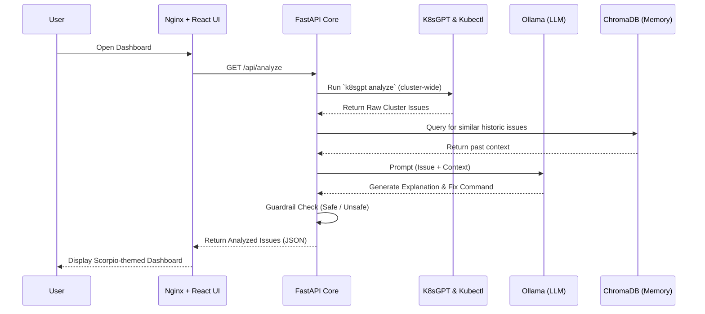
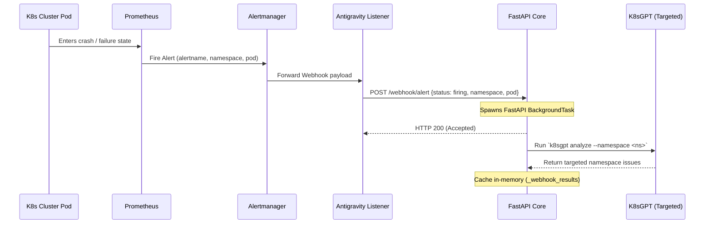
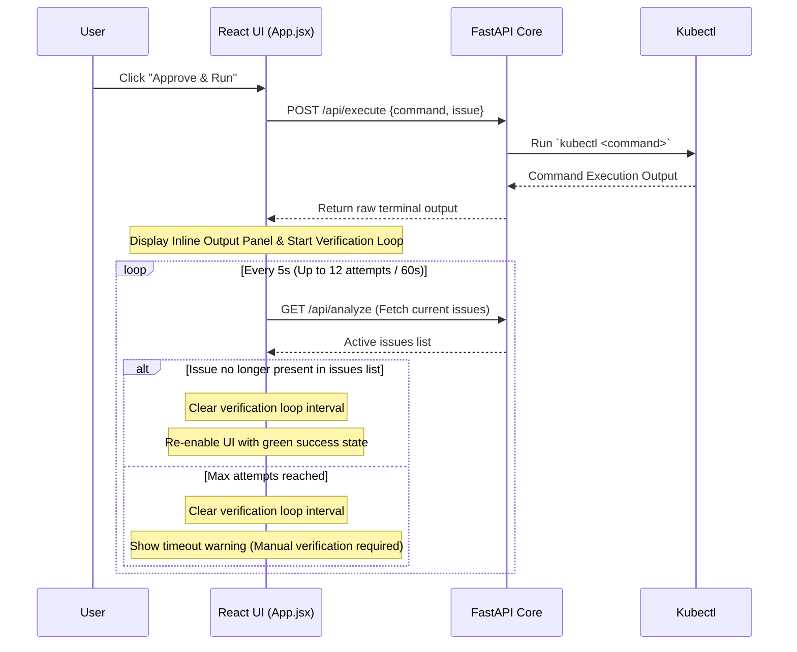

# K8s Agentic AI Architecture & Flow Guide

Welcome to the detailed architectural breakdown of the **K8s Agentic AI Dashboard**. This document explains the purpose, components, and data flow of the entire system, combining insights from the Kubernetes deployments, FastAPI backend, and React frontend.

---

## 🎯 What is it used for?

The K8s Agentic AI system is a **powerful, autonomous troubleshooting pipeline** designed to monitor, diagnose, and remediate issues within a Kubernetes cluster. 

Instead of an administrator manually hunting down failing pods or reading cryptic logs, this system automatically:
1. Discovers cluster issues using `k8sgpt`.
2. Analyzes the root cause using a private, local Large Language Model (Ollama with Gemma 2B).
3. Consults an "Incident Memory" (Vector Database) to remember past fixes.
4. Suggests a concrete `kubectl` command to fix the issue.
5. Provides a beautiful, web-based UI where an admin can safely **Approve & Run** the remediation with one click.

---
## 🔄 End-to-End System Flow

The following sequence diagrams illustrate the two primary workflows: **Manual Analysis & Execution** and **Event-Driven Webhook Processing**.

### 1. Manual Analysis & Execution Flow
This flow represents the standard user interaction when opening the dashboard, viewing detected cluster faults, and executing/verifying a suggested fix.

### 2. Event-Driven Webhook Alert Flow
This flow describes the autonomous pipeline triggered when a Kubernetes resource enters a failure state, alerting the system without human intervention.

### 3. Execution & Verification Loop Flow
After clicking "Approve & Run", the frontend replaces traditional blocking window alerts with an inline panel and launches a verification loop to confirm the fix succeeded.

---

## 🖥️ The Frontend Approach

The frontend is a **React + Vite** application built for speed and aesthetics. 

> [!TIP]
> The UI uses a custom **Scorpio Theme** built entirely with pure, vanilla CSS. It avoids heavy external libraries like Tailwind or Bootstrap to keep the bundle size incredibly small while delivering a premium, dark-mode, glassmorphic aesthetic with neon accents.

### Routing & Communication
Because the React app runs in the user's browser, it cannot directly resolve internal Kubernetes DNS (like `backend.k8s-ai.svc.cluster.local`). To solve this:
- The frontend is served inside the cluster using an **Nginx** web server.
- Nginx is configured as a **Reverse Proxy**. 
- The React app makes requests to `/api`, and Nginx intercepts these and securely forwards them to the internal FastAPI backend service.

### Remediation Verification Loop
When a user approves a fix, the frontend initiates a verification sequence:
- The Action Button changes state to show verification is in progress (`Verifying fix… poll N/12`).
- A background `setInterval` polls the backend every 5 seconds to query active issues.
- If the issue is resolved and disappears from the issues list, the loop terminates and the dashboard refreshes automatically.
- Includes a manual **Refresh button** in the header along with a **Last refreshed** timestamp.

---

## 🧠 The Backend Approach

The backend is built with **FastAPI** (Python) and acts as the "Intelligence Core" of the system. It orchestrates the interactions between the cluster and the AI.

### Directory Structure & Roles
- **Agents (`app/agents/`)**: 
  - `analyzer.py`: Parses the raw JSON output from K8sGPT. Now accepts a `namespace` parameter to restrict analysis.
  - `reasoning.py`: Asks Ollama to explain the issue, injecting historic context from the Vector Store to improve accuracy.
  - `action.py`: Generates the actionable `kubectl` command.
  - `guardrail.py`: Blocks destructive commands. If the AI suggests `delete`, `rm`, or `wipe`, the guardrail marks it as `safe: false`.
- **Tools (`app/tools/`)**: Subprocess runners for `k8sgpt` (supports `--namespace`), `kubectl`, `ollama`, and `vector_store.py` (ChromaDB).

> [!IMPORTANT]
> **Incident Memory**: Every time a user successfully runs an action via the dashboard, the backend saves the `(Issue -> Successful Command)` pairing into ChromaDB. The next time a similar issue occurs, the Reasoning agent fetches this memory and feeds it to the LLM, effectively allowing the system to **learn** from past outages.

### Webhook API & Background Processing
To avoid blocking Alertmanager timeouts, the backend implements asynchronous background jobs:
- `POST /webhook/alert`: Receives alert payloads from the Antigravity Listener. If the status is `firing`, it queues a FastAPI `BackgroundTask` to analyze only the affected namespace. If the status is `resolved`, the cached result is popped and removed from memory.
- `GET /webhook/results`: Serves cached analysis results to the frontend dashboard.
- `GET /health`: Liveness/readiness check route.

---

## 🐳 The Kubernetes (K8s) Approach

The entire architecture is "Cloud-Native Ready" and designed to be deployed directly inside the cluster it is monitoring.

### Component Breakdown
1. **Namespace (`namespace.yaml`)**: Creates a dedicated `k8s-ai` sandbox to keep our tools organized and secure.
2. **Ollama (`ollama.yaml`)**: Deploys the LLM runner. By keeping the LLM strictly within the cluster, sensitive infrastructure logs are **never** sent to public APIs like OpenAI. 
3. **Backend (`backend.yaml`)**: Deploys the FastAPI intelligence core. 
    - **Incident Memory**: Enabled by default with environment variable `KUBEOPS_ENABLE_VECTOR_STORE: "true"`.
    - **Host Access**: To allow the backend pod to execute `kubectl` commands against its host cluster, the deployment explicitly mounts the host node's kubeconfig (e.g., `/etc/rancher/k3s/k3s.yaml` for K3s). A `ClusterRoleBinding` is also used to grant the default ServiceAccount admin permissions.
4. **Frontend (`frontend.yaml`)**: Deploys the Nginx container serving the React UI. It uses a `NodePort` (30007) to expose the beautiful dashboard to the outside world.

---

## 📈 The Observability Stack

The system has evolved from a simple "Polling" architecture to a fully **Event-Driven Loop** with the addition of the observability stack.

### Components
1. **Prometheus** (NodePort `32001`): Scrapes metrics from the cluster and evaluates `alert.rules` (e.g., detecting `PodCrashLooping`).
2. **Alertmanager** (NodePort `32002`): Routes firing alerts from Prometheus to our custom webhook bridge.
3. **Grafana** (NodePort `32000`): Visualizes cluster health with pre-provisioned dashboards (Default credentials: `admin` / `admin`).
4. **Antigravity Listener**: A Python FastAPI webhook receiver (`antigravity-listener.yaml`) that routes alerts from Alertmanager to KubeOps-AI backend webhook endpoints.
