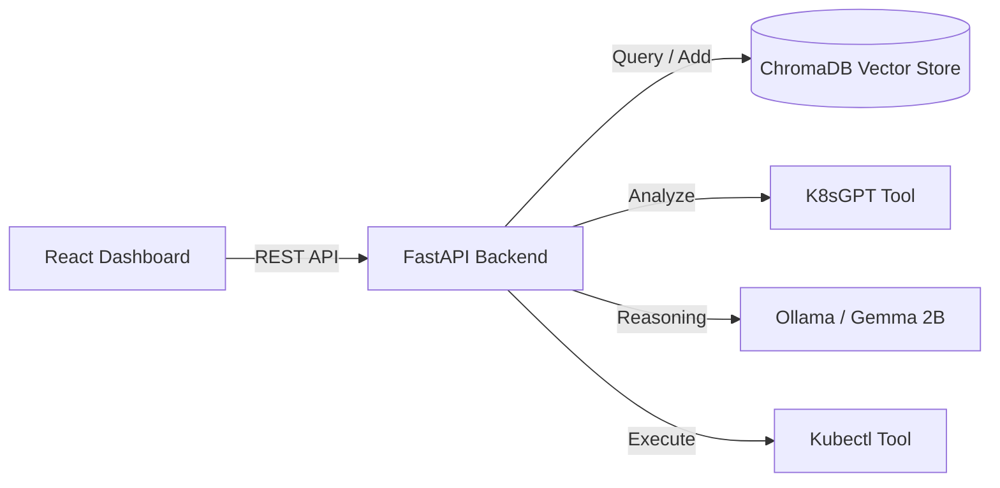

# KubeOps-AI

<div align="center">
  
  
  
  
</div>

<br/>

**K8s Agentic AI Dashboard** is a powerful, autonomous troubleshooting pipeline that leverages local AI (Ollama + Gemma 2b) to analyze your Kubernetes clusters, deduce root causes, suggest actionable fixes, and maintain an **Incident Memory** vector database. Features a full **Approve & Run** interface to fix issues safely in just one click.


---

## ✨ Features

- **🧠 Agentic AI Pipeline**: Combines K8sGPT for issue discovery with local LLMs (Ollama) to deeply analyze Kubernetes faults.
- **📚 Incident Vector Memory**: Uses `ChromaDB` + `SentenceTransformers` to store historic issues and solutions. The reasoning agent references previous fixes.
- **🛡️ Guardrails Built-in**: Pre-execution filters prevent catastrophic commands (e.g., `delete`, `wipe`) to protect cluster integrity.
- **⚡ "Approve & Run" UI**: A beautiful Vite + React Dashboard where administrators review AI-generated reasoning before executing `kubectl` actions.
- **🐳 Cloud-Native Ready**: Includes native Kubernetes Deployments, Services, and Dockerfiles to run directly within your clusters.

---

## 🏗️ Architecture



---

## 🛠️ Tech Stack

- **Backend:** Python, FastAPI, Pydantic, ChromaDB, SentenceTransformers
- **Frontend:** React, Vite, Axios
- **AI / Tools:** Ollama (Gemma 2B model), K8sGPT, Native Kubectl bindings

---

## 🚀 Quick Start (Local Run)

### 1. Prerequisites
- `kubectl` configured with cluster access.
- `k8sgpt` installed on your machine.
- [Ollama](https://ollama.ai/) installed.

### 2. Start the AI Model
```bash
ollama serve
ollama pull gemma:2b
```

### 3. Start the Backend
```bash
python -v venv venv
source venv/bin/activate
pip install -r requirements.txt

uvicorn app.main:app --reload
```

### 4. Start the Frontend
```bash
cd frontend
npm install
npm run dev
```

---

## 🐳 Kubernetes Deployment

To deploy this entire stack into a Kubernetes cluster, head over to the `k8s/` folder.

```bash
# Don't forget to push these to your image registry!
docker build -t hardik0811/k8s-agent-backend:latest .
cd frontend && docker build -t yourregistry/k8s-agent-frontend:latest .

kubectl apply -f k8s/namespace.yaml
kubectl apply -f k8s/ollama.yaml
kubectl apply -f k8s/backend.yaml
kubectl apply -f k8s/frontend.yaml
```

*Note: Our backend deployment expects access to Kubeconfig. By default, it maps `/etc/rancher/k3s/k3s.yaml` for K3s clusters.*

---

## 📝 License
MIT License
